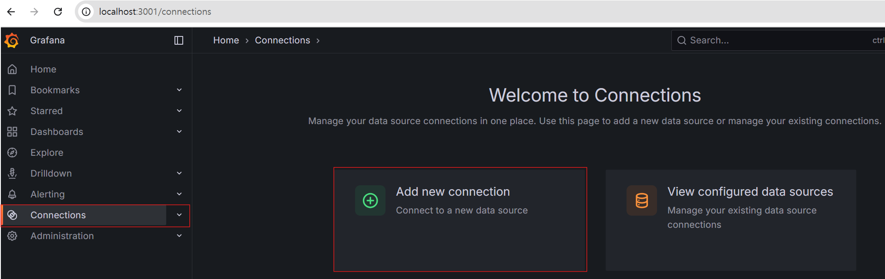
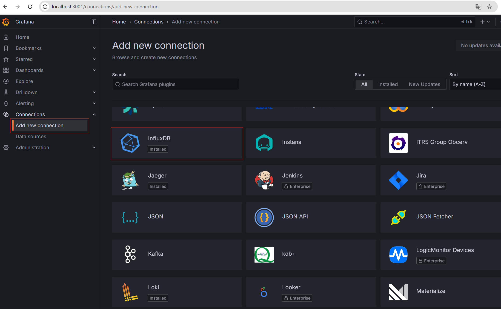
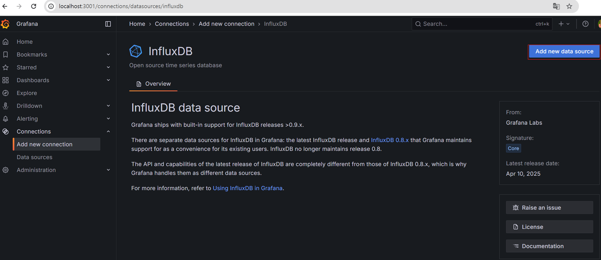
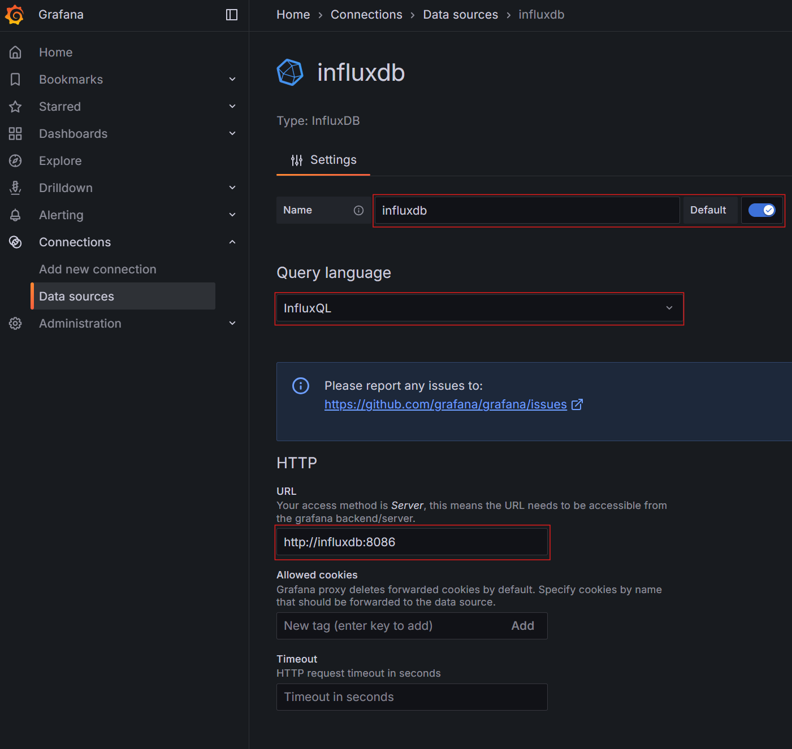
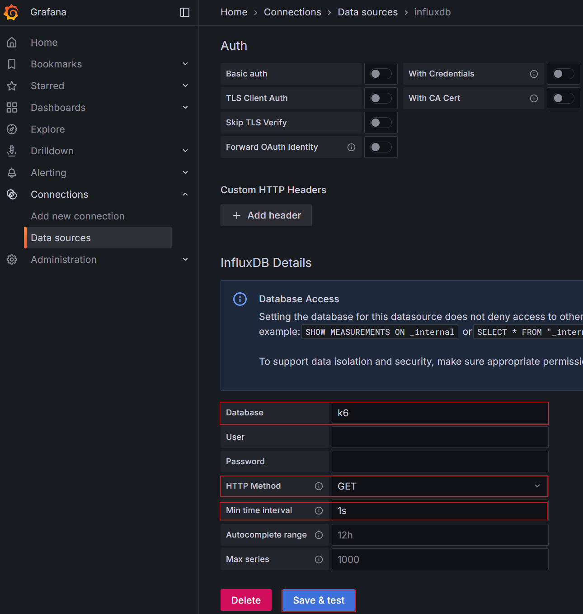
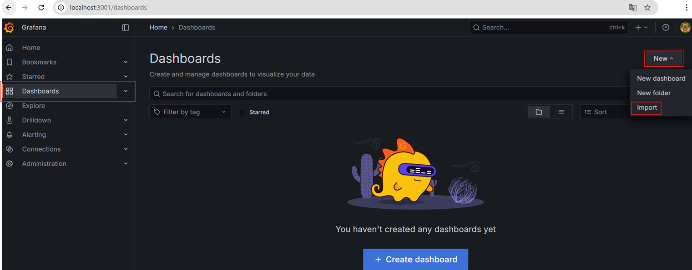
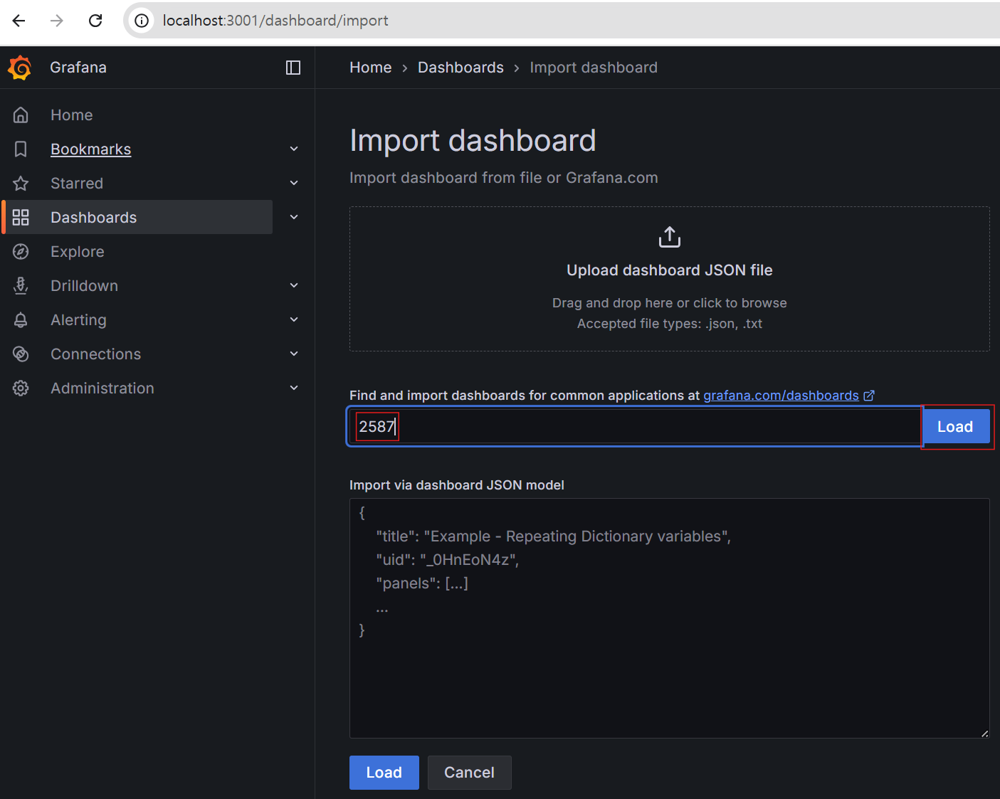
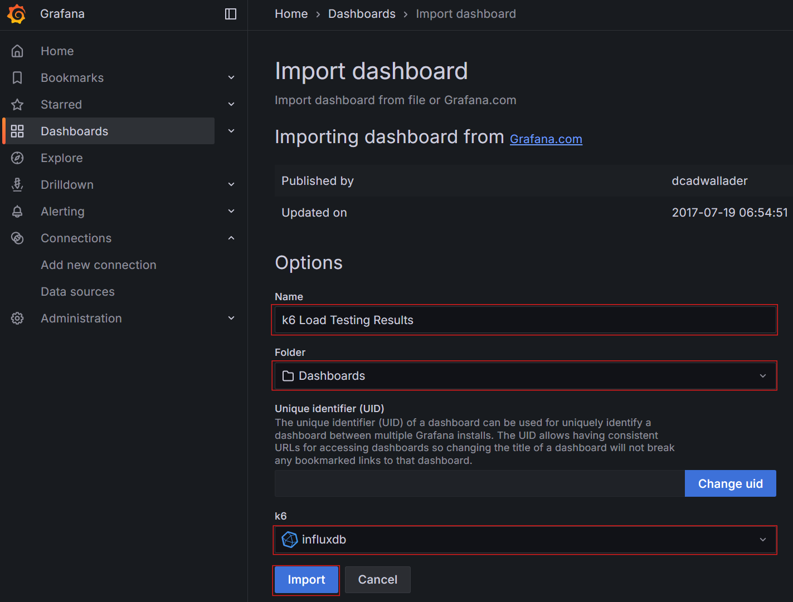
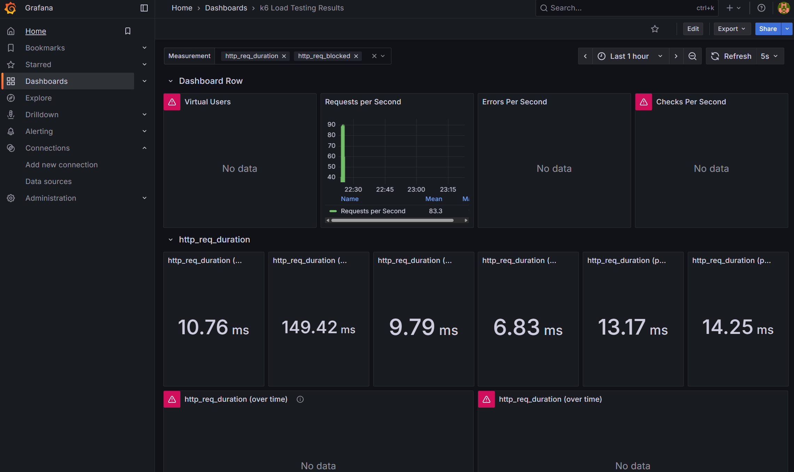
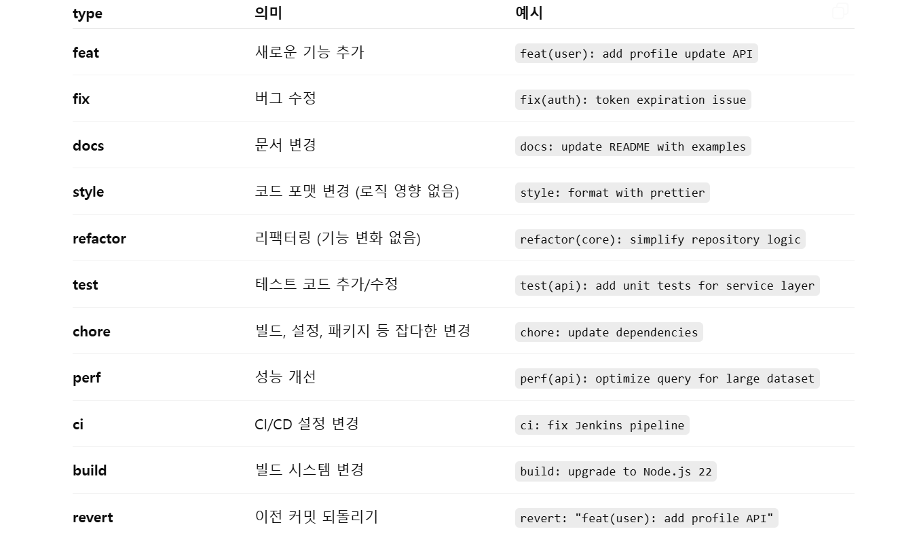

## API 부하 및 데이터 처리 효율 실험 공간

NestJS를 기반으로 트래픽 부하, 대량 데이터 처리 성능,
리소스 효율성을 검증하기 위한 테스트 공간

### 구성 요소
| 요소 | 역할         | 포트 | 비고          |
|:-----------|:-----------|:------:|:------------|
| **MySQL** | DB         | `3306` |           |
| **InfluxDB** | k6 메트릭 저장소 | `8086` | 부하 테스트 결과 저장 |
| **Grafana** | 모니터링 대시보드  | `3001` | 시각화 대시보드    |
|  **NestJS** | API Server | `3000` | 부하 테스트 대상   |
| **k6** | 부하 테스트 도구  | - | CLI 기반 실행   |

#### k6 설치 (Windows 기준)
```shell
  # PowerShell 에서 설치
  $ choco install k6
  
  # 설치 확인
  $ k6 version
```

#### Docker Compose (DB + 모니터링 환경 실행)
```shell
  # MySQL, InfluxDB, Grafana 컨테이너 한번에 실행
  $ docker compose up -d
````
- Grafana 대시보드 접속 : http://localhost:3001
  - ID : admin, PW : admin (참고 : 최초 로그인 후 패스워드 변경해야 함)
- Grafana Connections 설정
  - 
  - 
  - 
  - 
  - 
- Grafana DashBoard 설정
  - 
  - 
  - 
  - 

#### Prisma 명령어 실행
- .env 설정 후 아래 명령어 실행
```shell
  # 마이그레이션 파일 생성 및 DB 반영
  $ npx prisma migrate dev --name [작업명]
  EX) $ npx prisma migrate dev --name init
    
  # Prisma Client 생성 또는 갱신
  $ npx prisma generate
```

#### 부하 테스트 실행 (k6 → InfluxDB → Grafana)
```shell
  # 실행 명령어
  $ k6 run [파일명]
  EX) $ k6 run /load-test/user-create-sequential-test.js
    
  # InfluxDB + Grafana 대시보드로 메트릭 출력
  $ k6 run --out influxdb=http://localhost:8086/k6 [파일명]
  EX) $ k6 run --out influxdb=http://localhost:8086/k6 ./load-test/user-create-sequential-test.js
```

#### (참고) Git Commit Message Convention
- 아래 규칙에 따라 커밋 메세지 작성
  